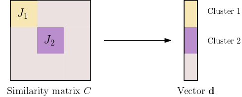

# Multi-Slice Clustering Extension

This code implements the extension of the multi-slice clustering algorithm [1]. Our algorithm, called MSC extension, aims to extract the different clusters of slices that lie in the different subspaces from the data when the data set is a sum of r rank-one tensors (r > 0). Our algorithm uses the
same input hyperparameters as the MSC algorithm.

* The MSC returns the two clusters as a single cluster.
* The MSC extension is able to separate the two clusters.
